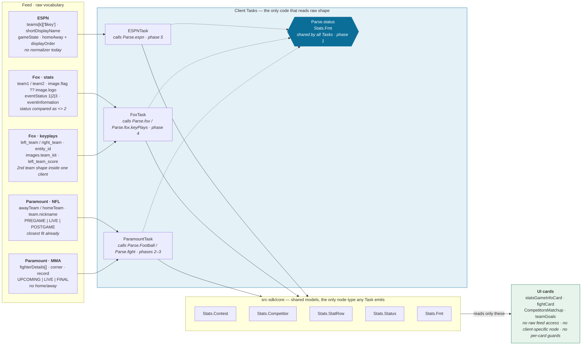

[← What raw passthrough costs](04-cost-of-raw-data.md) · [Index](README.md) · Next: [Field-by-field mapping →](06-field-mapping.md)

# 5. The proposed models

Five types, derived from what all three clients already build.

These are not new inventions. Each one is the intersection of shapes the clients already construct.

- `Parse.Football.teamSide` is within a field or two of the target already.
- That's the evidence the abstraction fits, rather than being imposed.

## Where normalization lives — and where it must not

Today's parse functions already do the right transformation; they just do it from the wrong place.

- `Parse.Football.teamSide` runs from inside `Stats.Game.bs`.
- `Parse.fighters` runs from inside `Stats.Fight.bs`.
- `Stats.Event.bs`'s `beforeParseData` runs from inside a node whose own `.xml` interface declares `team1`/`team2` as raw assocarrays and `status` as a bare Fox integer (`Stats.Event.xml:11-15`).

That interface is itself the problem, independent of where the parsing code physically runs. A client-specific ContentNode is a second model.

- Every card that reads `m.top` on `Stats.Event` couples to *its* interface, not the shared one.
- That interface can grow a new Fox-only field the moment a dev needs one, with no shared-model gatekeeping in the way.
- Putting the parse call inside the node doesn't cause that on its own — but a client-specific node makes the deviation possible and easy, which is exactly the failure mode this proposal closes off.

So the design puts normalization in the **Task** — `FoxTask`, `ParamountTask`, and an ESPN equivalent — which has no XML interface of its own to deviate through. A Task is not a ContentNode; it can only ever construct and emit the shared `Stats.*` node. There is no `Stats.Event` for a Fox-only field to hide in, so the only way to satisfy a client's need is to extend the shared model itself. Client-specific requirements stop being reasons to reinvent a client's own shape, and start being the input that makes `Stats.Competitor`, `Stats.Contest`, and the rest more capable for every client at once:



- Every feed keeps its own vocabulary right up to the Task boundary.
- The client's own Task is the **only** code that reads raw response shape, and the only thing it can construct is a `Stats.*` node — no `Stats.Event`, no `Stats.Game`, no client-specific interface left for a field to hide in.
- All three Tasks call the same `Parse.status` and `Stats.Fmt` — that's what stops the three `record()` implementations from re-diverging.

`Parse.status` sits in `Parse.*`, not on `Stats.Status` — same reason parsing moved out of `Stats.Event`.

- A `.normalize()` method hanging off the model implies the model knows how to read raw client shape. That's the exact coupling this proposal removes.
- `Stats.Status` stays a plain enum with query methods (`isLive`, `isUpcoming`, `isFinal`) that operate on its own already-normalized value.
- Nothing that accepts a raw int or client-specific string lives on the model.

New rule for new requirements:

- If a client needs a field the shared model doesn't carry, add that field to `Stats.Competitor`/`Stats.Contest`/etc. for every client.
- Don't grow a client-specific node around it.
- Client-specific need becomes the input to improving the shared model, not an excuse to route around it.

Downstream of the Task there is one shape.

- A card can no longer walk `athletes[…["$key"]].country.flag.href`.
- The traversal is already resolved.
- There's no node left whose interface would let it try.

## Stats.Competitor

One side of a contest — a team or an individual.

```brightscript
{
  id            as string     ' always a string; ESPN's "$key", Fox entity_id
  shortName     as string     ' "LV" — the abbreviated form
  displayName   as string     ' "Raiders" / "Jon Jones"
  logo          as string     ' resolved from flag/logo/team_kit/image.url
  primaryColor  as string     ' "" when the feed has none
  secondaryColor as string
  score         as integer
  record        as Stats.Record
  rank          as integer    ' 0 = unranked
}
```

**Shape proven by** (logic to relocate into `ParamountTask`/`FoxTask`, not left in place): `Parse.Football.teamSide` (`Stats.Game.bs:102`) · `Parse.fighters` (`Stats.Fight.bs:59`) · `teamPoster.bs:39` · `StatsModel.brs:359`

## Stats.Contest

A game, match, or fight — the container every panel is built around.

```brightscript
{
  id          as string
  status      as Stats.Status      ' the shared enum, never a raw feed value
  scheduled   as string            ' ISO8601, unparsed
  period      as integer           ' quarter / round / half
  clock       as string            ' "12:04", pre-formatted by the feed
  seasonType  as Stats.SeasonType  ' which season — NOT scheduling status
  home        as Stats.Competitor  ' semantic sides, resolved once at parse
  away        as Stats.Competitor
  competitors as Stats.Competitor[]  ' feed order, for non-H2H (fight cards)
  title       as string
  note        as string            ' Fox eventNotes, ESPN disclaimers
}
```

**Shape proven by** (logic to relocate into the client's Task; `Stats.Event`'s own `.xml` interface — `team1`/`team2` as raw assocarrays, `status` as a bare Fox integer — is retired, not carried forward): `Stats.Game parsePregame` (`Stats.Game.bs:38`) · `Stats.Event beforeParseData` (`Stats.Event.bs:11`) · `Stats.Fight` (`Stats.Fight.bs:17`)

## Stats.Status

Two levels: a `phase` cards branch on, and a `detail` that keeps what the feed said. A single flat enum cannot do both — today's normalizers prove it, folding 17 (NFL) and 13 (MMA) raw inputs down to three values and discarding the rest.

### Why two levels

- **`phase` is what the UI actually asks.** Every consumer today asks a coarse question — `isPregame`/`isLive`/`isPostgame`, or a raw `= "LIVE"` compare. None branch on a specific sub-state.
- **The three phases already exist, re-derived per client.** `footballCardManifest.phaseKey()` maps the NFL enum to `"pre"`/`"live"`/`"post"`; `paramountStats.bs:221-227` hand-rolls the same mapping from raw MMA strings; `statsCardConfig.bs` keys every card list on those three. This promotes that shared vocabulary into the model instead of restating it per client.
- **`detail` stops the information loss.** `"HALFTIME"` currently becomes indistinguishable from `"IN_PROGRESS"`, and `"ENDED"` from `"FINAL"`. A scoreboard wanting to show "HALF" has nowhere to read it from.
- **It gives the unmodelled states a home.** `DELAYED`, `POSTPONED`, `CANCELED`, `SUSPENDED` are accepted by no current normalizer and fall through to `unknown`.
- **Which part you are in is not a status, but halftime is.** `period` and `regulationParts` describe *position*; `halftime` describes a *broadcast state* with its own programming. They are not interchangeable — NFL declares 4 quarters, so halftime is the break after part 2 of 4, and hockey's is after part 2 of 3. There is no arithmetic on part count that picks it out across sports, and the feeds already say `"HALFTIME"` outright. Deriving what the feed hands you is a lossy round-trip.
- **`betweenParts` covers the rest.** Between rounds of a fight, between quarters, between innings — a stoppage with no show attached.

```brightscript
' the coarse lifecycle — the only thing a card must handle
enum Stats.Phase
  future  = "FUTURE"
  live    = "LIVE"
  past    = "PAST"
  unknown = "UNKNOWN"
end enum

' the sub-status — additive detail, never required to render
enum Stats.StatusDetail
  ' future
  scheduled    = "SCHEDULED"
  delayed      = "DELAYED"
  postponed    = "POSTPONED"

  ' live
  inProgress   = "IN_PROGRESS"
  halftime     = "HALFTIME"       ' the broadcast's own break — feeds send this
  betweenParts = "BETWEEN_PARTS"  ' any other stoppage between parts
  suspended    = "SUSPENDED"

  ' past
  final        = "FINAL"
  canceled     = "CANCELED"
  abandoned    = "ABANDONED"

  unknown      = "UNKNOWN"
end enum
```

`Stats.Status` carries both, so one value answers either question:

```brightscript
' Stats.Status
'   phase  as Stats.Phase          ' branch on this
'   detail as Stats.StatusDetail   ' read this only when you have something to show
'   raw    as string               ' the feed's own value, kept for debugging

' model methods — operate on an already-normalized Stats.Status value only
Stats.Status.isLive(status)
Stats.Status.isFuture(status)
Stats.Status.isPast(status)
```

```brightscript
' Parse.status lives alongside Parse.Football / Parse.fight / Parse.fox — it is
' called from within each client's Task, never from the model
Parse.status(raw) as Stats.Status   ' accepts int (Fox 1/2/3) and every
                                     ' string vocabulary the three clients use
```

An unrecognised input yields `phase = unknown` while `raw` still holds the original — the value never renders, but it stays diagnosable.

### Migration is additive

`isLive` keeps its meaning, so NFL's 20 call sites move over unchanged. MMA's eight raw-string compares (`fight.status = "LIVE"`) become `Stats.Status.isLive(...)` — the enum it already had but never adopted, since `FightStatus.isFinal`/`isLive`/`isUpcoming` are dead code today.

**Replaces:** `T.Fox.EventStatus` · `T.Paramount.GameStatus` · `T.Paramount.FightStatus` · every `<> 2` literal

## Stats.SeasonType

Which season a contest belongs to. Distinct from `Stats.Status`, which says where the contest is in its own lifecycle.

- **The two vocabularies collide on the same tokens.** `"PRE"` and `"POST"` mean *preseason* and *postseason* to `Parse.Football.seasonTypeLabel` (`Stats.Game.bs:220`), and *pregame* and *postgame* to `GameStatus.normalize` (`enums.bs:29-33`). Both `ucase()` the input and compare bare strings, so only the choice of function tells them apart.
- **No live bug today — they read different fields.** Status comes from `data.status`, season from `data.season.seasonType`. The hazard is that both accept-lists are deliberately wide, so a feed change that moves or renames either field mislabels silently rather than failing.
- **Currently display-only.** `seasonTypeLabel` returns a presentation string (`"Regular Season"`), so nothing downstream can branch on the season without re-parsing prose. A typed field lets the model answer the question directly.

```brightscript
enum Stats.SeasonType
  preseason  = "PRESEASON"
  regular    = "REGULAR"
  postseason = "POSTSEASON"
  offseason  = "OFFSEASON"
  unknown    = "UNKNOWN"
end enum
```

```brightscript
' accepts the feed's short and long spellings alike — "PRE"/"PRESEASON",
' "POST"/"POSTSEASON", "REGULAR" — and is the only place that mapping lives
Parse.seasonType(raw) as Stats.SeasonType

' display stays a formatter, fed by the typed value rather than by raw text
Stats.Fmt.seasonName(seasonType)   ' regular -> "Regular Season"
```

Playoff round names (`"Wild Card"`, `"Divisional"`) stay as text beside the enum, as they are today — nothing branches on the round, so typing it would be structure ahead of a need.

**Replaces:** `Parse.Football.seasonTypeLabel`'s string matching (`Stats.Game.bs:220-229`)

## Stats.Format

Each contest declares its own part structure. Nothing else in the model knows what a quarter, a round or a half is.

- **The count is data, not code.** NFL declares 4 parts, a UFC main event 5, soccer 2. `Quarter.displayName()` currently hardcodes NFL's four-then-overtime shape in an if-chain, and `Parse.WeekGames.periodLabel()` hardcodes it again — MMA gets a third copy inline in `fightCard.badgeText()` as `"R" + round`.
- **Format answers "which part", not "what is happening".** `period` is a position within the declared structure; the status detail says whether play is running, halted for the halftime show, or halted for anything else. Halftime is *not* derivable from position — NFL's is after part 2 of 4, hockey's after part 2 of 3 — so it stays a status detail, not an arithmetic result.
- **Overtime is a part past the regulation count.** `period > format.regulationParts` answers it for every sport, so `finalOvertime` does not need to exist as a status.

```brightscript
' Stats.Format — declared once per contest by its client's Task
'   partNoun         as string    ' "QUARTER" | "ROUND" | "HALF" | "PERIOD" | "INNING"
'   partNounShort    as string    ' "Q" | "R" | "H" | "P"
'   regulationParts  as integer   ' 4 (NFL) · 5 (UFC main) · 2 (soccer) · 9 (MLB)
'   overtimeNoun     as string    ' "OVERTIME" | "" when the sport has none

' Stats.Contest carries the current position within that structure
'   period as integer             ' 1-based, counts past regulationParts into overtime
'   format as Stats.Format
```

```brightscript
' one labeller, driven by the declared format — replaces Quarter.displayName,
' Parse.WeekGames.periodLabel, and fightCard's inline "R" + round
Stats.Fmt.partName(period, format)       ' 3, NFL   -> "3RD QUARTER"
Stats.Fmt.partNameShort(period, format)  ' 3, NFL   -> "3RD"
                                         ' 2, UFC   -> "R2"
                                         ' 5, NFL   -> "OVERTIME"

Stats.Contest.isOvertime(contest)        ' period > format.regulationParts
```

**Replaces:** `Quarter.displayName` · `Parse.WeekGames.periodLabel` · `fightCard.badgeText`'s inline round label

## Stats.StatRow

One comparison row — the unit behind every H2H and leaders card.

```brightscript
{
  key    as string            ' "totalYards"
  label  as string            ' "Total Yards"
  home   as Stats.StatValue   ' { value, note, share, rank }
  away   as Stats.StatValue
  leader as string            ' "home" | "away" | "" — never recomputed in a card
}
```

**Shape proven by** (logic to relocate into the client's Task): `Parse.Football.gameRow` (`Stats.Game.bs:367`) · `previewRow` (`:296`) · Fox `teamGoals.bs:81` `{template, text, value, barPercentage}`

## Stats.Fmt

Promotion of the existing helper to the shared layer, unchanged.

```brightscript
Stats.Fmt.int / number / decimal / ordinal
Stats.Fmt.record(record)      ' one output format, chosen deliberately
Stats.Fmt.playerName(player)  ' "G. Minshew"
```

**Promoted from:** `paramount/server/FootballService/models/footballFormat.bs` — currently reachable by one service of one client
