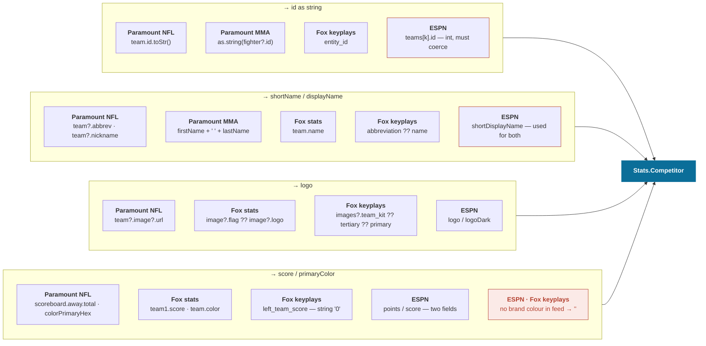
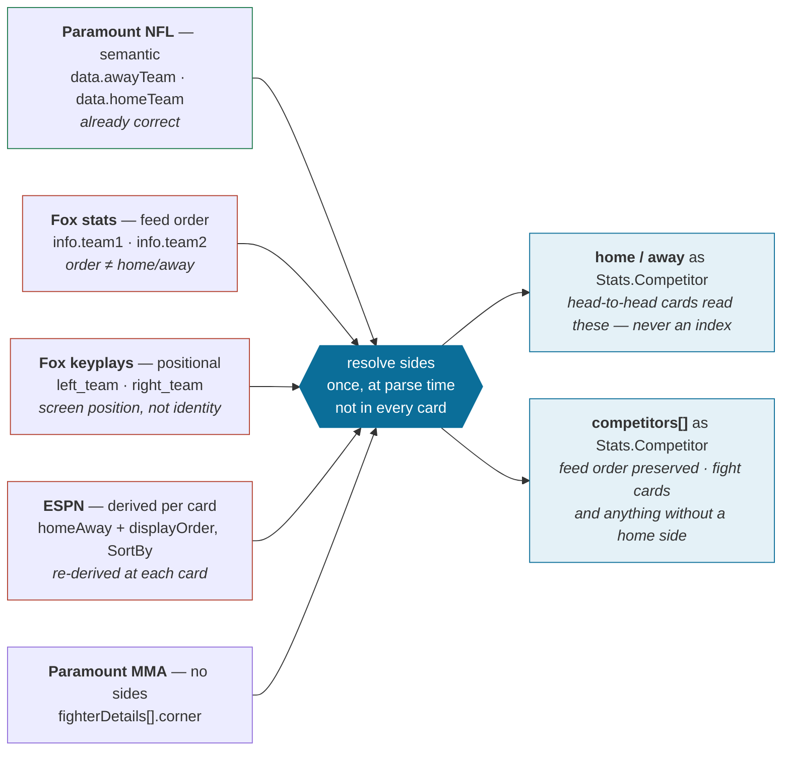
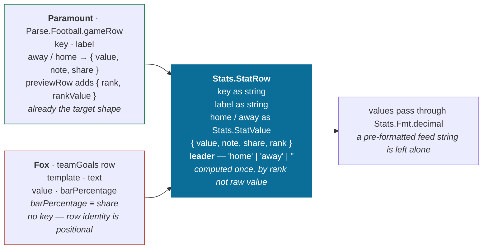

[← The proposed models](05-proposed-models.md) · [Index](README.md) · Next: [Rollout →](07-rollout.md)

# 6. Field-by-field mapping

Every source path, per client, per model field.

- These are the actual expressions in the working tree, not paraphrases.
- Where a client resolves a value through a fallback chain, the whole chain is given — that chain gets deleted once the client's Task owns it.
- See [5. The proposed models](05-proposed-models.md#where-normalization-lives--and-where-it-must-not) for why that logic lives in the Task, not a client-specific ContentNode.

---

## Stats.Competitor

| Model field | Paramount NFL | Paramount MMA | Fox stats | Fox keyplays | ESPN |
| --- | --- | --- | --- | --- | --- |
| `id` | `team.id.toStr()` | `as.string(fighter?.id)` | `team1` / `team2` | `entity_id` | `teams[k].id` ⚠ int |
| `shortName` | `team?.abbrev` | — | `abbreviation` | `abbreviation ?? name` | `shortDisplayName` |
| `displayName` | `team?.nickname` | `firstName + lastName` | `team.name` | `name` | `shortDisplayName` ⚠ |
| `logo` | `team?.image?.url` | `faceoffView?.url` | `image?.flag ?? image?.logo` | `team_kit ?? tertiary ?? primary` | `logo` / `logoDark` |
| `score` | `scoreboard.away.total` | — | `team1.score` | `left_team_score` ⚠ string | `points` / `score` |
| `primaryColor` | `team?.colorPrimaryHex` | — | `team.color` | ✗ none | ✗ none |
| `record` | `Fmt.record(currentStandings)` | `Parse.record(fighter?.record)` | — | — | `record` |

Two details drive real decisions:

- **ESPN's `id` is an integer.** Every other feed gives a string. The parse must coerce, or lookups silently miss.
- **ESPN reuses `shortDisplayName`** for both `shortName` and `displayName`. One of the two is approximate until a better field is found.

---

## Stats.Contest — sides

This is the mapping with the highest bug potential.

`away/home`, `team1/team2` and `left/right` answer three different questions — semantic, feed-ordered, and positional. Today each card decides for itself.

Fix: resolve once at parse, and expose *both* named sides and an ordered array. Covers head-to-head and fight cards without either borrowing the other's assumption.

---

## Stats.StatRow

| Model field | Paramount | Fox | Note |
| --- | --- | --- | --- |
| `key` | `key` | ✗ none | Fox rows addressable only by position |
| `label` | `label` | `text` / `template` | |
| `home` / `away` | `{ value, note, share }` | `value` + `barPercentage` | `barPercentage` ≡ `share` |
| `rank` | `previewRow` only | — | |
| `leader` | ✗ new | ✗ new | computed by rank, not raw value |

- `leader` is the one genuinely new field.
- Computed by league rank, not raw value — so lower-is-better stats like yards allowed don't highlight the wrong side.

---

## Stats.Status

Covered in full in [2. Status divergence](02-status-divergence.md), including the normalize flow diagram.

| `phase` | Fox | Paramount NFL | Paramount MMA | ESPN |
| --- | --- | --- | --- | --- |
| `future` | `2` | `"PREGAME"` `"PRE"` `"SCHEDULED"` `"UPCOMING"` `"FUTURE"` | `"UPCOMING"` `"SCHEDULED"` `"PRE"` `"PREGAME"` `"FUTURE"` | raw `gameState` `"pre"` |
| `live` | `1` | `"LIVE"` `"IN"` `"IN_PROGRESS"` `"INPROGRESS"` `"ACTIVE"` `"HALFTIME"` | `"LIVE"` `"IN_PROGRESS"` `"INPROGRESS"` `"ACTIVE"` | raw `"in"` |
| `past` | `3` | `"POSTGAME"` `"POST"` `"FINAL"` `"COMPLETE"` `"COMPLETED"` `"ENDED"` | `"FINAL"` `"COMPLETE"` `"COMPLETED"` `"ENDED"` | raw `"post"` |
| `unknown` | — | fallback | fallback | ✗ no fallback today |

The `detail` sub-status is what keeps these folds from losing information:

| `phase` | `detail` | Sourced from |
| --- | --- | --- |
| `future` | `scheduled` | the default for any accepted future value |
| `future` | `delayed` `postponed` | ✗ no client accepts these today — they fall to `unknown` |
| `live` | `inProgress` | `"LIVE"` `"IN"` `"IN_PROGRESS"` `"ACTIVE"` · Fox `1` |
| `live` | `halftime` | `"HALFTIME"` — accepted by NFL today, then flattened into `live` and lost |
| `live` | `betweenParts` | any other stoppage between parts — ✗ not accepted today |
| `live` | `suspended` | ✗ not accepted today |
| `past` | `final` | `"FINAL"` `"POSTGAME"` `"COMPLETE"` · Fox `3` |
| `past` | `canceled` `abandoned` | ✗ not accepted today |

Overtime and "which part" are deliberately absent from this table — they belong to `Stats.Format`, not to status. `period > format.regulationParts` answers "is this overtime" for every sport. Halftime is the exception that stays a status: it is a broadcast state the feed names directly, and its position varies by sport (after part 2 of 4 in the NFL, 2 of 3 in hockey), so no rule over part count picks it out.
