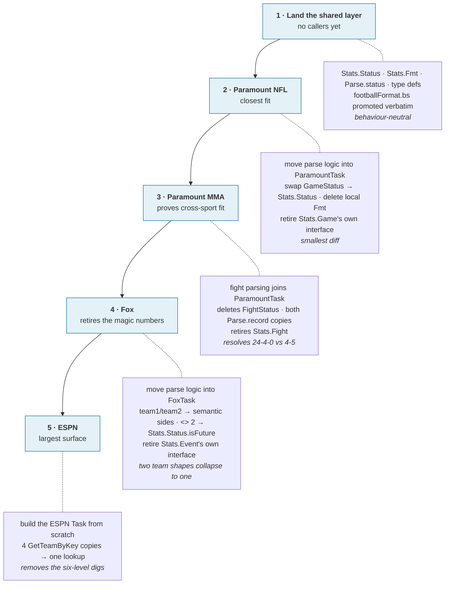

[← Field-by-field mapping](06-field-mapping.md) · [Index](README.md) · Next: [Open decisions →](08-open-decisions.md)

# 7. Where this lives, and how it lands

`src-sdk/core/` is the natural home and is effectively empty today — it holds only `brandingUtils.brs`, so there is no existing structure to fight.

Every phase below moves parsing out of a client-specific ContentNode (`Stats.Game`, `Stats.Event`, `Stats.Fight`) and into that client's Task (`ParamountTask`, `FoxTask`, an ESPN equivalent).

- The Task is the only thing each phase adds a raw-shape reader to.
- It has no XML interface of its own.
- Once a phase lands, the client-specific node it replaced is deleted — not kept around as a second, quieter model.

See [5. The proposed models](05-proposed-models.md#where-normalization-lives--and-where-it-must-not) for why that boundary has to be the Task and not the node.

The order below:

- Each phase ships independently.
- ESPN (the risky client) goes last, after the models are proven twice.

## 1 · Land the shared layer with no callers

- Add `Stats.Status`, `Stats.Fmt`, `Parse.status`, and the type definitions to `src-sdk/core`.
- `Parse.status` lives in `Parse.*`, not as a `Stats.Status.normalize` method — deliberate, so the model stays a plain enum that never touches raw client shape.
- `footballFormat.bs` is promoted verbatim. No behaviour change, easy to review.

## 2 · Migrate Paramount NFL — the closest fit

- `Stats.Game` already produces these shapes. The work is moving that logic into `ParamountTask` so it emits `Stats.Contest`/`Stats.Competitor` directly.
- Swap `GameStatus` for `Stats.Status`.
- Delete the local `Fmt` and `Stats.Game`'s own interface once nothing reads it.
- Proves the models against the most-evolved client, with the smallest diff.

## 3 · Migrate Paramount MMA — proves cross-sport fit

The real test: fighters are competitors without home/away.

- Move fight parsing into `ParamountTask`, alongside the NFL path.
- Delete the duplicated `FightStatus` and both copies of `Parse.record`.
- Resolve `"24-4-0"` vs `"4-5"` into one deliberate choice.
- Retire the `Stats.Fight` node.

## 4 · Migrate Fox — retires the magic numbers

- Move `team1`/`team2` → semantic-sides resolution into `FoxTask`.
- Replace every `<> 2` with `Stats.Status.isFuture`.
- Retire `Stats.Event`'s own interface — `team1`/`team2`/raw-`status` stop being readable directly from a Fox card.
- Fox's two team shapes collapse into one `Stats.Competitor`.

## 5 · Migrate ESPN — largest surface, most benefit

- Build the ESPN Task so cards stop walking the response. There is no ESPN node today, so this adds the Task-side parse boundary from scratch rather than relocating one.
- Collapse the four `GetTeamByKey` copies into one competitor lookup.
- Removes the six-level digs.

Fix `BetsDataModel.brs:61` here or sooner — it's a real defect independent of this work.
